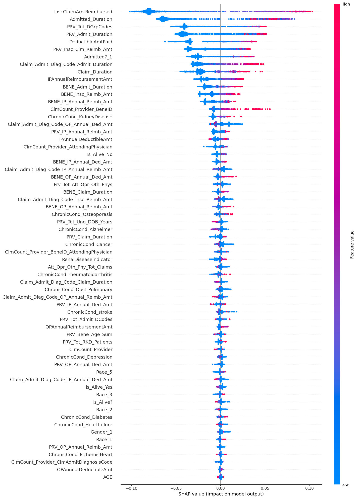
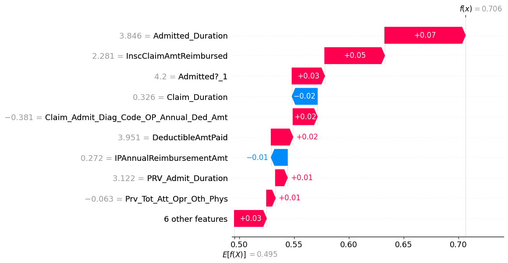

# Medicare Provider Fraud Detection (INFO 531 Final Project)

This project aims to detect potentially fraudulent healthcare providers using machine learning and deep learning techniques applied to Medicare claims data. It was developed as part of the final project for INFO 531: Data Warehousing and Analytics in the Cloud at the University of Arizona.

---

## Project Structure

- `notebooks/`
  - `01_Exploratory_Data_Analysis.ipynb` – Initial EDA to understand individual datasets
  - `02_Merged_Data_Exploration.ipynb` – Merging datasets and extended EDA
  - `03_Data_Modeling.ipynb` – Machine learning model training and evaluation
  - `04_NeuralNetworks.ipynb` – Deep learning experiments using feedforward neural networks
- `img/` – Contains charts and visualizations used in reporting and this README
- `data/` – (Not included in repo) Raw and processed Medicare datasets from Kaggle
- `models/` – Optional folder for serialized model artifacts
- `README.md` – Project overview and documentation

---

## Datasets

This project uses the [Healthcare Provider Fraud Detection Analysis dataset](https://www.kaggle.com/datasets/rohitrox/healthcare-provider-fraud-detection-analysis/data) from Kaggle. It includes:

- Inpatient claims data
- Outpatient claims data
- Beneficiary demographic and chronic condition data
- Fraud labels indicating if a provider is potentially fraudulent

---

## Methodology

### 1. Data Preparation
- Cleaned and merged multiple datasets (inpatient, outpatient, beneficiary)
- Engineered features like:
  - Claim duration
  - Admission duration
  - Binary indicators for chronic conditions
- Handled missing values and standardized numerical features
- Addressed class imbalance using SMOTE

### 2. Exploratory Data Analysis (EDA)
- Analyzed claim distributions by age, cost, and condition
- Identified abnormal patterns in provider-level claim behavior

### 3. Modeling and Evaluation
- Models Trained:
  - Logistic Regression
  - Decision Tree
  - Random Forest
  - XGBoost (best-performing)
  - Feedforward Neural Network (in `04_NeuralNetworks.ipynb`)
- Used a custom class `FraudModelEvaluator` for:
  - F1, Precision, Recall, and AUC scoring
  - ROC curve plotting and confusion matrix visualization
  - Threshold tuning for fraud sensitivity

---

## Visualizations

Key figures generated from EDA and model evaluation:

- 
- 

---

## Best Performing Model (XGBoost)

- F1 Score: ~0.52  
- AUC Score: ~0.85  
- Observations: Strong ability to capture complex fraud signals, resilient to class imbalance

---

## Key Learnings

- Domain-informed feature engineering is essential for fraud detection
- Class imbalance must be addressed explicitly for fair model performance
- XGBoost consistently outperforms traditional classifiers in real-world fraud use cases
- Neural networks can be explored further with hyperparameter tuning and embeddings

---

## Future Work

- Create a Power BI / Streamlit dashboard for fraud insights

---

## Contact

**Author:** Bharath Velamala  
**Course:** INFO 531 – Data Warehousing and Analytics in the Cloud  
**Instructor:** Dr. Nayem Rahman